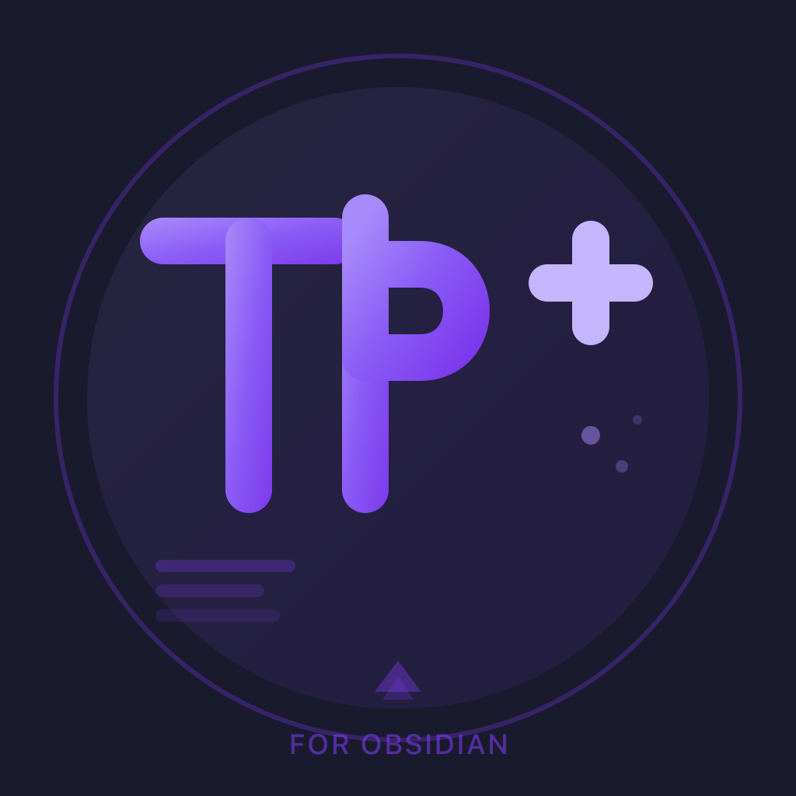

<p align="center">
  
</p>

# Teleprompter Plus

<p align="center">
  <strong>Professional teleprompter for Obsidian with Stream Deck integration</strong>
</p>

<p align="center">
  <a href="https://github.com/JuracyAmerico/obsidian-teleprompter-plus/releases">
    
  </a>
  <a href="LICENSE">
    
  </a>
  <a href="https://obsidian.md">
    
  </a>
  <a href="https://ko-fi.com/americocanada">
    
  </a>
</p>

<p align="center">
  Perfect for presentations, video recording, podcasts, speeches, and content creation.
</p>

---

## 📸 Screenshots

> **Coming Soon:** Screenshots showing the plugin in action. For now, install and try it yourself!

| Feature | Description |
|---------|-------------|
| **Main Interface** | Clean teleprompter view with eyeline guide and navigation panel |
| **Mobile Remote** | Control from your phone via web browser (v0.9.0+) |
| **Stream Deck** | Hardware integration with 55+ actions |
| **Settings** | Comprehensive customization options |

---

## ✨ Features

### 📜 Core Teleprompter Features
- **Auto-scrolling** - Smooth, variable-speed scrolling with precise control
- **Play/Pause controls** - One-click playback with optional countdown timer
- **Variable speed** - Adjust scrolling speed on the fly (configurable 0.5-10 range)
- **Dynamic font sizing** - Real-time text size adjustment (12-72px)
- **Reset to top** - Instantly jump back to the beginning
- **Countdown timer** - Optional countdown before auto-scroll starts
- **Manual scrolling** - Scroll up/down with customizable amounts
- **Flip mode** - Mirror text horizontally or vertically for teleprompter rigs

### 🎨 Display & Appearance
- **Full-screen mode** - Distraction-free, immersive view
- **Keep awake** - Prevent screen from sleeping during playback
- **Pin window** - Keep teleprompter always on top (macOS/Windows)
- **Clean interface** - Focus on your content with minimal UI
- **Theme integration** - Automatically adapts to your Obsidian theme
- **Resizable panels** - Customize navigation panel width
- **Line height control** - Adjust spacing for optimal readability

### 🗺️ Advanced Navigation
- **Hierarchical header navigation** - Collapsible tree view of document structure
- **Active section highlighting** - Visual indicator of current position
- **One-click section jumping** - Jump to any header instantly
- **Real-time position tracking** - Always know where you are in the document
- **Abstract scrollbar minimap** - Visual overview of document with position markers
- **Previous/Next section** - Navigate sequentially through headers
- **Scroll sync** - Editor and teleprompter stay in sync

### 🎮 Stream Deck Integration (55+ Actions)
- **External hardware control** - Full control via Stream Deck
- **Real-time state sync** - Bidirectional communication with visual feedback
- **8 action categories** - Playback, Speed, Font, Navigation, Display, Utility, Countdown, Flip
- **WebSocket API** - Local server on port 8765
- **Auto-reconnection** - Resilient connection handling
- **State indicators** - Visual feedback on Stream Deck buttons

### ⌨️ Complete Keyboard Control (25+ Commands)
- **Playback commands** - Play, pause, toggle
- **Speed control** - Increase, decrease, set specific speed
- **Font control** - Increase, decrease, reset size
- **Navigation** - Next/previous section, jump to top
- **Display** - Fullscreen, keep awake, pin window, minimap
- **Utility** - Scroll sync, countdown, flip modes
- **Customizable hotkeys** - Set your own keyboard shortcuts

### 📝 Full Markdown Support
- **Complete Obsidian syntax** - All Markdown features supported
- **Images** - Display embedded images inline
- **Code blocks** - Syntax highlighted code with highlight.js
- **Tables** - Formatted tables
- **Task lists** - Checkboxes and tasks
- **YAML frontmatter** - Automatically hidden from display
- **Math** - LaTeX equations
- **Callouts** - Obsidian callout boxes
- **Links** - Both internal and external links
- **Diagram placeholders** - Mermaid, PlantUML, and other diagrams shown as clean placeholders

### 🆕 v0.9.0 Features
- **Speed presets** - Cycle through 6 preset speeds (0.5x, 1x, 1.5x, 2x, 3x, 5x)
- **Custom hotkeys** - Define your own keyboard shortcuts for 12+ actions
- **Double-click to edit** - Click text in teleprompter to jump to that line in editor
- **Text alignment** - Cycle through left, center, right, and RTL alignment
- **Progress indicator styles** - Choose between progress bar, scrollbar, or none
- **Eyeline indicator** - Draggable reading position guide
- **Diagram placeholders** - Clean "📊 Flowchart" style placeholders for Mermaid diagrams

### ⚡ Performance Optimizations
- **Debounced scroll handling** - Smooth performance with large documents
- **Memoized markdown rendering** - Skip re-rendering unchanged content
- **requestAnimationFrame scrolling** - Consistent 60fps smooth scrolling
- **Passive event listeners** - Improved scroll performance
- **Batch DOM operations** - Efficient header registration

### 🛠️ Advanced Settings
- **Scroll speed configuration** - Set default, min, max speeds
- **Speed increment** - Customize adjustment amounts
- **Navigation preferences** - Default width, remember state
- **Auto-start options** - Automatically begin playing
- **Debug mode** - Verbose logging for troubleshooting
- **WebSocket configuration** - Port, host, auto-start settings

---

## 📦 Installation

### Method 1: Manual Installation (Recommended)

1. **Download the latest release**
   - Go to the [Releases page](https://github.com/americo/obsidian-teleprompter-plus/releases)
   - Download `obsidian-teleprompter-plus-v0.9.0.zip`

2. **Extract to plugins folder**
   ```bash
   # Extract the zip file to your vault's plugins directory
   unzip obsidian-teleprompter-plus-v0.9.0.zip -d <vault>/.obsidian/plugins/
   ```

3. **Install WebSocket module** (Required for Stream Deck)
   ```bash
   cd <vault>/.obsidian/plugins/obsidian-teleprompter-plus/
   bun install ws
   # Or copy the ws module from node_modules if included
   ```

4. **Enable the plugin**
   - Open Obsidian
   - Go to Settings → Community Plugins
   - Reload plugins if necessary
   - Enable "Teleprompter Plus"

### Method 2: Build from Source

```bash
# 1. Clone the repository
git clone https://github.com/JuracyAmerico/obsidian-teleprompter-plus.git
cd obsidian-teleprompter-plus

# 2. Install dependencies
bun install

# 3. Build the plugin
bun run build

# 4. Copy to your vault's plugins folder
mkdir -p "<vault>/.obsidian/plugins/obsidian-teleprompter-plus"
cp dist/main.js dist/styles.css manifest.json "<vault>/.obsidian/plugins/obsidian-teleprompter-plus/"

# 5. Copy WebSocket module (required for Stream Deck)
cp -r node_modules/ws "<vault>/.obsidian/plugins/obsidian-teleprompter-plus/"

# 6. Reload Obsidian and enable the plugin
```

---

## 🚀 Quick Start

### Basic Usage

1. **Open Teleprompter**
   - Click the teleprompter icon in the left ribbon, or
   - Use Command Palette: `Cmd/Ctrl + P` → "Open Teleprompter Plus"

2. **Load a Note**
   - Open any note in Obsidian
   - The teleprompter automatically displays the active note
   - Content updates in real-time as you edit

3. **Control Playback**
   - Click  **Play** to start auto-scrolling
   - Use **+/-** buttons to adjust speed
   - Click  **Reset** to return to top
   - Press  **Pause** to stop scrolling

4. **Adjust Appearance**
   - Use  **Aa+/-** buttons to change font size
   - Click fullscreen icon for distraction-free mode
   - Toggle navigation panel to see document structure

### Navigation Panel

The navigation panel shows a hierarchical tree of all headers in your document:

- **Toggle**: Click the menu icon
- **Navigate**: Click any header to jump to that section
- **Collapse/Expand**: Click arrows to show/hide nested sections
- **Active highlighting**: Current section is highlighted in blue
- **Resize**: Drag the right edge to adjust panel width

### Minimap (Abstract Scrollbar)

When navigation panel is hidden, a minimap appears on the right:

- **Position indicator**: Blue viewport shows current scroll position
- **Header markers**: Colored bars indicate section positions
- **Click to jump**: Click anywhere on minimap to jump to that position
- **Hover to expand**: Minimap widens on hover for easier interaction

---

## ⌨️ Keyboard Shortcuts

All commands are available in the Command Palette (`Cmd/Ctrl + P`). Set custom hotkeys in **Settings → Hotkeys → Teleprompter Plus**.

### Playback Control
| Command | Description |
|---------|-------------|
| **Toggle Play/Pause** | Start or stop auto-scrolling |
| **Play** | Start auto-scrolling |
| **Pause** | Stop auto-scrolling |
| **Reset to Top** | Jump to beginning of document |

### Speed Control
| Command | Description |
|---------|-------------|
| **Increase Scroll Speed** | Speed up scrolling (uses speed increment setting) |
| **Decrease Scroll Speed** | Slow down scrolling |
| **Set Scroll Speed** | Set specific speed value |

### Font Size Control
| Command | Description |
|---------|-------------|
| **Increase Font Size** | Make text larger (+2px) |
| **Decrease Font Size** | Make text smaller (-2px) |
| **Reset Font Size** | Reset to default (24px) |

### Navigation
| Command | Description |
|---------|-------------|
| **Next Section** | Jump to next header |
| **Previous Section** | Jump to previous header |
| **Toggle Navigation Panel** | Show/hide navigation sidebar |

### Display Controls
| Command | Description |
|---------|-------------|
| **Toggle Full-Screen Mode** | Enter/exit fullscreen |
| **Toggle Keep Awake** | Prevent screen from sleeping |
| **Toggle Pin Window** | Keep window always on top (macOS/Windows) |
| **Toggle Minimap** | Show/hide abstract scrollbar |

### Advanced Controls
| Command | Description |
|---------|-------------|
| **Toggle Scroll Sync** | Sync teleprompter with editor |
| **Start Countdown** | Begin countdown timer |
| **Cancel Countdown** | Stop countdown timer |
| **Toggle Flip Horizontal** | Mirror text horizontally |
| **Toggle Flip Vertical** | Flip text vertically |
| **Toggle Flip Both** | Flip horizontally and vertically |

### Utility Commands
| Command | Description |
|---------|-------------|
| **Open Teleprompter Plus** | Open teleprompter view |
| **Show WebSocket Server Info** | Display connection info and status |

> **Tip**: To avoid conflicts with Obsidian's zoom shortcuts, font size commands don't have default hotkeys. Set custom shortcuts in Settings → Hotkeys.

---

## 🎮 Stream Deck Integration

### Overview

The plugin includes a built-in WebSocket server that enables full control via Elgato Stream Deck. Control playback, speed, font size, navigation, and all features using hardware buttons.

**WebSocket Server**: `ws://127.0.0.1:8765`

### 55+ Available Actions

#### 1. Playback Control (8 actions)
- **Play/Pause** - Toggle playback with state indicator
- **Play** - Start scrolling
- **Pause** - Stop scrolling
- **Reset to Top** - Jump to beginning
- **Scroll Up** - Manual scroll up
- **Scroll Down** - Manual scroll down
- **Set Scroll Amount** - Configure manual scroll distance
- **Get State** - Request current state update

#### 2. Speed Control (5 actions)
- **Speed Up** - Increase scroll speed
- **Speed Down** - Decrease scroll speed
- **Set Speed** - Set specific speed value
- **Speed to Min** - Set to minimum speed
- **Speed to Max** - Set to maximum speed

#### 3. Font Size Control (5 actions)
- **Font Size Up** - Increase text size
- **Font Size Down** - Decrease text size
- **Set Font Size** - Set specific size
- **Font Size to Min** - Set to 12px
- **Font Size to Max** - Set to 72px

#### 4. Navigation (7 actions)
- **Next Section** - Jump to next header
- **Previous Section** - Jump to previous header
- **Jump to Section** - Jump to specific header by index
- **First Section** - Jump to first header
- **Last Section** - Jump to last header
- **Toggle Navigation** - Show/hide navigation panel
- **Toggle Minimap** - Show/hide minimap

#### 5. Display (10 actions)
- **Toggle Fullscreen** - Enter/exit fullscreen
- **Enter Fullscreen** - Go fullscreen
- **Exit Fullscreen** - Leave fullscreen
- **Toggle Keep Awake** - Prevent sleep
- **Enable Keep Awake** - Turn on keep awake
- **Disable Keep Awake** - Turn off keep awake
- **Toggle Pin Window** - Keep on top
- **Pin Window** - Enable always on top
- **Unpin Window** - Disable always on top
- **Toggle Scroll Sync** - Sync with editor

#### 6. Countdown Timer (5 actions)
- **Start Countdown** - Begin countdown
- **Cancel Countdown** - Stop countdown
- **Set Countdown** - Set countdown duration (seconds)
- **Countdown 3s** - Quick 3-second countdown
- **Countdown 5s** - Quick 5-second countdown

#### 7. Flip Controls (8 actions)
- **Toggle Flip Horizontal** - Mirror horizontally
- **Toggle Flip Vertical** - Flip vertically
- **Toggle Flip Both** - Flip both axes
- **Enable Flip Horizontal** - Turn on horizontal flip
- **Disable Flip Horizontal** - Turn off horizontal flip
- **Enable Flip Vertical** - Turn on vertical flip
- **Disable Flip Vertical** - Turn off vertical flip
- **Reset Flips** - Disable all flips

#### 8. Section Management (7+ actions)
- **Expand All Sections** - Open all navigation items
- **Collapse All Sections** - Close all navigation items
- **Expand Section** - Open specific section
- **Collapse Section** - Close specific section
- **Toggle Section** - Expand/collapse section
- **Eyeline** - Custom position marker
- **Bookmarks** - Save and recall positions

### WebSocket API

#### Command Format
```json
{
  "command": "command-name",
  "value": 123  // Optional, for commands that take parameters
}
```

#### State Updates (Broadcasted)
```json
{
  "type": "state",
  "data": {
    "isPlaying": true,
    "speed": 2.5,
    "fontSize": 24,
    "scrollPosition": 1200,
    "maxScroll": 3000,
    "scrollPercentage": 40,
    "currentNote": "my-presentation.md",
    "currentNoteTitle": "My Presentation",
    "headers": [
      { "id": "header-0", "text": "Introduction", "level": 1 },
      { "id": "header-1", "text": "Background", "level": 2 }
    ],
    "currentHeaderIndex": 0,
    "navigationVisible": false,
    "minimapVisible": true,
    "isFullscreen": false,
    "keepAwake": false,
    "isPinned": false,
    "scrollSyncEnabled": false,
    "isCountingDown": false,
    "countdownSeconds": 0,
    "flipHorizontal": false,
    "flipVertical": false,
    "timestamp": 1697832000000
  }
}
```

#### Example Commands
```javascript
// Toggle play/pause
ws.send(JSON.stringify({ command: "toggle-play" }))

// Set speed to 3
ws.send(JSON.stringify({ command: "set-speed", value: 3 }))

// Jump to second header (index 1)
ws.send(JSON.stringify({ command: "jump-to-header", value: 1 }))

// Request state update
ws.send(JSON.stringify({ command: "get-state" }))
```

### Setting Up Stream Deck

1. **Install Stream Deck Software**
   - Download from [Elgato's website](https://www.elgato.com/en/downloads)
   - Install and launch Stream Deck app

2. **Install Teleprompter Plus Plugin**
   - Coming soon: Official Stream Deck plugin in Elgato Marketplace
   - Manual installation: [Stream Deck Plugin Repository](https://github.com/americo/streamdeck-obsidian-teleprompter)

3. **Configure Actions**
   - Drag actions from Teleprompter Plus category to your Stream Deck
   - Configure each action's settings (e.g., speed values, section indices)
   - Test connection: "Get State" action should show current teleprompter state

4. **Verify Connection**
   - Open Teleprompter Plus in Obsidian
   - Check for WebSocket server notification
   - Use Command Palette: "Show WebSocket Server Info"
   - Stream Deck should show "Connected" status

### Custom Control Scripts

You can also control the teleprompter from custom scripts:

```javascript
// Node.js example
const WebSocket = require('ws')
const ws = new WebSocket('ws://127.0.0.1:8765')

ws.on('open', () => {
  // Start playing
  ws.send(JSON.stringify({ command: 'play' }))

  // Speed up after 5 seconds
  setTimeout(() => {
    ws.send(JSON.stringify({ command: 'set-speed', value: 5 }))
  }, 5000)
})

ws.on('message', (data) => {
  const message = JSON.parse(data)
  if (message.type === 'state') {
    console.log('Current speed:', message.data.speed)
    console.log('Scroll position:', message.data.scrollPercentage + '%')
  }
})
```

---

## ⚙️ Settings

Access settings via **Settings → Teleprompter Plus**.

### Appearance

| Setting | Description | Default |
|---------|-------------|---------|
| **Font Size** | Base text size for teleprompter | 24px (12-72px) |
| **Line Height** | Spacing between lines | 1.6 (1.0-3.0) |

### Playback

| Setting | Description | Default |
|---------|-------------|---------|
| **Default Scroll Speed** | Initial speed when opening teleprompter | 2 (0.5-10) |
| **Minimum Scroll Speed** | Lowest allowed speed | 0.5 |
| **Maximum Scroll Speed** | Highest allowed speed | 10 |
| **Speed Increment** | Amount speed changes per +/- press | 0.5 (0.1-2) |
| **Countdown Duration** | Seconds to count down before playing | 0 (disabled) |

### Navigation

| Setting | Description | Default |
|---------|-------------|---------|
| **Default Navigation Width** | Initial width of navigation panel | 250px |
| **Remember Navigation State** | Persist panel open/closed state | Yes |
| **Show Active Section Highlight** | Highlight current section in navigation | Yes |
| **Show Minimap** | Display abstract scrollbar when nav hidden | Yes |

### Behavior

| Setting | Description | Default |
|---------|-------------|---------|
| **Auto-Start Playing** | Begin playing immediately on open | No |
| **Scroll Sync with Editor** | Keep editor and teleprompter in sync | No |

### WebSocket Server

| Setting | Description | Default |
|---------|-------------|---------|
| **Auto-Start Server** | Start server when Obsidian launches | Yes |
| **WebSocket Port** | Port for external connections | 8765 |
| **WebSocket Host** | Host address (localhost for security) | 127.0.0.1 |
| **Show Connection Notifications** | Display server start/stop messages | Yes |
| **Server Status** | Real-time connection info | (read-only) |

### Developer

| Setting | Description | Default |
|---------|-------------|---------|
| **Debug Mode** | Enable verbose console logging | No |

> **Note**: Debug mode requires reloading Obsidian to take effect. Use for troubleshooting only, as it generates significant console output.

---

## 💡 Use Cases

### 📹 Video Recording
Perfect for creating YouTube videos, tutorials, or presentations:
- Load your script into teleprompter
- Set comfortable reading speed
- Use Stream Deck for hands-free control
- Keep eye contact with camera while reading

### 🎤 Public Speaking
Deliver confident speeches and presentations:
- Structure your talk with headers for easy navigation
- Jump between sections for Q&A
- Practice with variable speeds
- Use countdown timer before starting

### 🎙️ Podcasting
Stay on track during podcast recordings:
- Load show notes and talking points
- Navigate sections for segment transitions
- Use minimap for quick position checks
- Sync with editor for real-time note taking

### 📝 Content Creation
Write and review long-form content:
- Review articles at reading speed
- Check flow and pacing
- Use navigation for quick section access
- Flip mode for in-person teleprompter rigs

### 🎓 Educational Content
Create lessons and lectures:
- Organize content with hierarchical headers
- Jump between concepts easily
- Use scroll sync for live editing
- Full markdown support for code examples

---

## 🔧 Troubleshooting

### WebSocket Server Issues

**Problem**: Server won't start / "Port already in use" error

**Solutions**:
- Check if another Obsidian instance is running
- Close other applications using port 8765
- Change port in Settings → Teleprompter Plus → WebSocket Port
- Restart Obsidian after changing settings

**Problem**: Stream Deck not connecting

**Solutions**:
- Verify Obsidian is running with plugin enabled
- Check WebSocket server status: Command Palette → "Show WebSocket Server Info"
- Ensure Stream Deck plugin is installed and configured correctly
- Try restarting WebSocket server from settings
- Check firewall settings (allow localhost connections)

### Content Issues

**Problem**: Content not updating when switching notes

**Solutions**:
- Close and reopen teleprompter view
- Ensure note is active (clicked in editor)
- Check console for errors: `Cmd/Ctrl + Shift + I`
- Enable Debug Mode in settings for detailed logging

**Problem**: Images not displaying

**Solutions**:
- Use proper Markdown syntax: ``
- Ensure images are in vault or use absolute paths
- Check image file exists and is accessible
- Verify image format is supported (PNG, JPG, GIF, SVG)

**Problem**: YAML frontmatter showing in teleprompter

**Solutions**:
- Plugin automatically strips frontmatter
- If visible, ensure it's formatted correctly with `---` delimiters
- Report bug if issue persists

### Performance Issues

**Problem**: Laggy scrolling with large documents

**Solutions**:
- Plugin is optimized for large documents, but very long files (>10k lines) may be slow
- Try reducing navigation panel complexity by closing nested sections
- Disable debug mode if enabled
- Close other resource-intensive Obsidian plugins temporarily

**Problem**: High CPU usage

**Solutions**:
- Check if debug mode is enabled (Settings → Developer)
- Disable scroll sync if enabled
- Close navigation panel if not needed
- Restart Obsidian to clear any memory leaks

### Display Issues

**Problem**: Fullscreen not working

**Solutions**:
- Fullscreen expands within Obsidian window (not true OS fullscreen)
- For true fullscreen: Use Obsidian's View → Toggle Fullscreen first
- macOS: Ensure app has display permissions in System Preferences

**Problem**: Pin window not working

**Solutions**:
- macOS/Windows only feature (not available on Linux)
- Requires Electron API support
- Some window managers may override this behavior
- Try closing other "always on top" windows

### Installation Issues

**Problem**: Plugin not appearing after installation

**Solutions**:
- Verify files are in correct location: `<vault>/.obsidian/plugins/obsidian-teleprompter-plus/`
- Required files: `main.js`, `styles.css`, `manifest.json`
- Check folder name matches plugin ID exactly
- Reload Obsidian: `Cmd/Ctrl + R`

**Problem**: "Module not found: ws" error

**Solutions**:
- WebSocket module not installed correctly
- Run `bun install ws` in plugin folder
- Or copy `node_modules/ws/` to plugin folder
- For built-from-source: Ensure ws is bundled in build

**Problem**: Plugin fails to load

**Solutions**:
- Check Obsidian version (requires 1.0.0+)
- Look for errors in Developer Console: `Cmd/Ctrl + Shift + I`
- Verify manifest.json is valid JSON
- Try reinstalling from scratch
- Enable Debug Mode for detailed error logs

### Getting Help

If issues persist:

1. **Check Console Logs**
   - Open Developer Console: `Cmd/Ctrl + Shift + I`
   - Look for errors (red text)
   - Enable Debug Mode for verbose logging

2. **Report Issues**
   - [GitHub Issues](https://github.com/americo/obsidian-teleprompter-plus/issues)
   - Include: Obsidian version, plugin version, error messages, steps to reproduce
   - Screenshots or video recordings are very helpful

3. **Community Support**
   - [GitHub Discussions](https://github.com/americo/obsidian-teleprompter-plus/discussions)
   - [Obsidian Forum Thread](https://forum.obsidian.md/...)

---

## 🛠️ Development

### Tech Stack

- **Framework**: Svelte 5 (latest with runes: `$state`, `$effect`)
- **Language**: TypeScript
- **Build Tool**: Vite
- **Styling**: Tailwind CSS + custom CSS
- **API**: Obsidian Plugin API
- **WebSocket**: ws library
- **Markdown**: marked.js + highlight.js

### Project Structure

```
obsidian-teleprompter-plus/
├── src/
│   ├── main.ts                      # Plugin entry point
│   ├── view.ts                      # View registration
│   ├── TeleprompterApp.svelte       # Main UI component (1800+ lines)
│   ├── settings.ts                  # Settings tab and interface
│   ├── websocket-server.ts          # WebSocket server implementation
│   └── websocket-loader.ts          # Dynamic ws module loading
├── dist/                            # Build output
│   ├── main.js                      # Compiled plugin
│   └── styles.css                   # Compiled styles
├── manifest.json                    # Plugin manifest
├── package.json                     # Dependencies
├── tsconfig.json                    # TypeScript config
├── vite.config.ts                   # Vite config
├── tailwind.config.js               # Tailwind config
└── README.md                        # This file
```

### Setup Development Environment

```bash
# 1. Clone repository
git clone https://github.com/JuracyAmerico/obsidian-teleprompter-plus.git
cd obsidian-teleprompter-plus

# 2. Install dependencies
bun install

# 3. Start development server with hot reload
bun run dev

# 4. Build for production
bun run build

# 5. Preview production build
bun run preview
```

### Development Workflow

1. **Make changes** to source files in `src/`
2. **Hot reload** updates automatically with `bun run dev`
3. **Test in Obsidian** by symlinking or copying to vault plugins folder
4. **Build** with `bun run build` before committing
5. **Update version** in `manifest.json` for releases

### Key Files to Understand

#### `src/main.ts`
- Plugin lifecycle (load, unload)
- Command registration (25+ commands)
- Settings management
- WebSocket server initialization
- View registration with Obsidian

#### `src/TeleprompterApp.svelte`
- Main UI component (all features)
- Reactive state management with Svelte 5 runes
- Event handlers for all controls
- WebSocket client integration
- Markdown rendering pipeline
- Performance optimizations (debouncing, memoization, RAF)

#### `src/settings.ts`
- Settings interface definition
- Default values
- Settings tab UI
- Validation and persistence

#### `src/websocket-server.ts`
- WebSocket server setup
- Client connection management
- Command parsing and routing
- State broadcasting
- Error handling and reconnection

### Performance Considerations

The plugin implements several optimizations:

1. **Debounced Scroll Handler** (50ms)
   - Reduces CPU usage during scrolling
   - Uses passive event listeners

2. **Memoized Markdown Rendering**
   - Skips re-rendering unchanged content
   - Tracks last rendered content

3. **requestAnimationFrame for Auto-Scroll**
   - Smooth 60fps scrolling
   - Time-based delta calculations for consistent speed

4. **Batch DOM Operations**
   - Header registration uses RAF
   - Reduces layout thrashing

5. **Conditional Logging**
   - Debug mode prevents log spam in production
   - 78+ logs hidden by default

### Contributing

Contributions are welcome! Here's how:

1. **Fork** the repository
2. **Create a branch** for your feature: `git checkout -b feature/amazing-feature`
3. **Make your changes** following existing code style
4. **Test thoroughly** in Obsidian
5. **Commit** with clear messages: `git commit -m "Add amazing feature"`
6. **Push** to your fork: `git push origin feature/amazing-feature`
7. **Open a Pull Request** with description of changes

#### Contribution Guidelines

- **Code Style**: Follow existing TypeScript/Svelte patterns
- **Naming**: Use camelCase for variables, PascalCase for components
- **Comments**: Add JSDoc comments for public functions
- **Testing**: Test with various document sizes and themes
- **Performance**: Avoid blocking operations, use RAF for animations
- **Accessibility**: Maintain keyboard navigation and ARIA labels

#### Development Tips

- Use Debug Mode to see detailed logs
- Test with long documents (1000+ lines)
- Test with multiple themes (light/dark)
- Test WebSocket with Stream Deck emulator
- Check console for errors regularly
- Use TypeScript strict mode

---

## 📋 Roadmap

### ✅ Completed Features (v0.5.0)
- ✅ Core teleprompter functionality
- ✅ Stream Deck integration (55+ actions)
- ✅ Complete keyboard control (25+ commands)
- ✅ Advanced navigation with hierarchical headers
- ✅ Abstract scrollbar minimap
- ✅ Active section highlighting
- ✅ Full-screen mode
- ✅ Keep awake functionality
- ✅ Pin window (macOS/Windows)
- ✅ Countdown timer (single-use)
- ✅ Flip modes (horizontal/vertical)
- ✅ Scroll sync with editor
- ✅ Advanced settings (speed, navigation, behavior)
- ✅ Performance optimizations
- ✅ Debug mode
- ✅ Full Markdown support
- ✅ Theme integration

### ✅ Completed Features (v0.9.0)

#### Core Features
- [x] **Professional teleprompter view** - Full-featured reading display
- [x] **Auto-scrolling** - Configurable speed with smooth animation
- [x] **Multiple themes** - 8 built-in profiles (Professional, Broadcast, Stream, Practice, etc.)
- [x] **Customizable colors** - Full color picker for text/background with presets
- [x] **Font family selection** - 10 font options
- [x] **Eyeline indicator** - Configurable reading position guide

#### Remote Control (v0.9.0)
- [x] **Remote web interface** - Control from any device on your network
- [x] **Mobile-optimized UI** - Touch-friendly controls for phone/tablet
- [x] **Real-time sync** - Instant state synchronization via WebSocket
- [x] **Section navigation** - Jump to headers from remote

#### Professional Features
- [x] **OBS integration** - Start/stop recording synced with teleprompter
- [x] **Stream Deck support** - 55+ actions for professional control
- [x] **Countdown timer** - Visual countdown before auto-scroll starts
- [x] **Focus mode** - Dim text outside eyeline for better focus
- [x] **Voice tracking (Beta)** - Experimental speech-following scroll

#### UX Enhancements
- [x] **Speed presets** - Quick switch between 6 preset speeds
- [x] **Custom hotkeys** - Define your own keyboard shortcuts
- [x] **Double-click to edit** - Jump to source line in editor
- [x] **Flip/mirror modes** - Horizontal and vertical flip
- [x] **Minimap** - Document overview with position indicator

### 💡 Feature Requests

Have an idea? [Open a discussion](https://github.com/JuracyAmerico/obsidian-teleprompter-plus/discussions) or [submit an issue](https://github.com/JuracyAmerico/obsidian-teleprompter-plus/issues)!

---

## 📄 License

MIT License - See [LICENSE](LICENSE) file for details.

Copyright (c) 2024-2025 Americo

Permission is hereby granted, free of charge, to any person obtaining a copy of this software and associated documentation files (the "Software"), to deal in the Software without restriction, including without limitation the rights to use, copy, modify, merge, publish, distribute, sublicense, and/or sell copies of the Software, and to permit persons to whom the Software is furnished to do so, subject to the following conditions:

The above copyright notice and this permission notice shall be included in all copies or substantial portions of the Software.

THE SOFTWARE IS PROVIDED "AS IS", WITHOUT WARRANTY OF ANY KIND, EXPRESS OR IMPLIED, INCLUDING BUT NOT LIMITED TO THE WARRANTIES OF MERCHANTABILITY, FITNESS FOR A PARTICULAR PURPOSE AND NONINFRINGEMENT. IN NO EVENT SHALL THE AUTHORS OR COPYRIGHT HOLDERS BE LIABLE FOR ANY CLAIM, DAMAGES OR OTHER LIABILITY, WHETHER IN AN ACTION OF CONTRACT, TORT OR OTHERWISE, ARISING FROM, OUT OF OR IN CONNECTION WITH THE SOFTWARE OR THE USE OR OTHER DEALINGS IN THE SOFTWARE.

---

## 🙏 Acknowledgments

Created with ❤️ by **Americo**

### Special Thanks To:

- **Obsidian Team** - For the excellent plugin API and amazing note-taking app
- **Elgato** - For Stream Deck SDK and documentation
- **Svelte Team** - For the reactive framework and Svelte 5 innovations
- **Open Source Community** - For inspiration and support

### Built With:

- [Obsidian](https://obsidian.md) - Knowledge base application
- [Svelte](https://svelte.dev) - Reactive UI framework
- [TypeScript](https://www.typescriptlang.org) - Type-safe JavaScript
- [Vite](https://vitejs.dev) - Fast build tool
- [Tailwind CSS](https://tailwindcss.com) - Utility-first CSS
- [marked.js](https://marked.js.org) - Markdown parser
- [highlight.js](https://highlightjs.org) - Syntax highlighting
- [ws](https://github.com/websockets/ws) - WebSocket library

---

## 📞 Support & Community

### Get Help

- 📖 **Documentation**: You're reading it!
- 🐛 **Bug Reports**: [GitHub Issues](https://github.com/americo/obsidian-teleprompter-plus/issues)
- 💬 **Discussions**: [GitHub Discussions](https://github.com/americo/obsidian-teleprompter-plus/discussions)
- 💡 **Feature Requests**: [GitHub Issues](https://github.com/americo/obsidian-teleprompter-plus/issues/new)
- 🗨️ **Community Forum**: [Obsidian Forum](https://forum.obsidian.md/)

### Stay Updated

- ⭐ **Star** the repo to show support
- 👀 **Watch** for updates and releases
- 🔔 **Subscribe** to release notifications

### Support Development

If you find this plugin useful and want to support its development:

<a href="https://ko-fi.com/americocanada">
  
</a>

Your support helps with:
- Continued development and new features
- Bug fixes and maintenance
- Documentation improvements
- Community support

### Share Your Experience

If you enjoy using Teleprompter Plus:
- Share it with the Obsidian community
- Leave feedback on the forum
- Contribute improvements
- Report bugs to help make it better

---

## 📊 Project Stats

- **Version**: 0.9.0
- **Lines of Code**: 3000+ (TypeScript/Svelte)
- **Commands**: 25+
- **Stream Deck Actions**: 55+
- **Settings Options**: 15+
- **Supported Platforms**: Windows, macOS, Linux (desktop only)
- **Minimum Obsidian Version**: 1.0.0

---

**Made with ❤️ for the Obsidian community**

*Transform your notes into professional presentations with Obsidian Teleprompter Plus* 🎬
