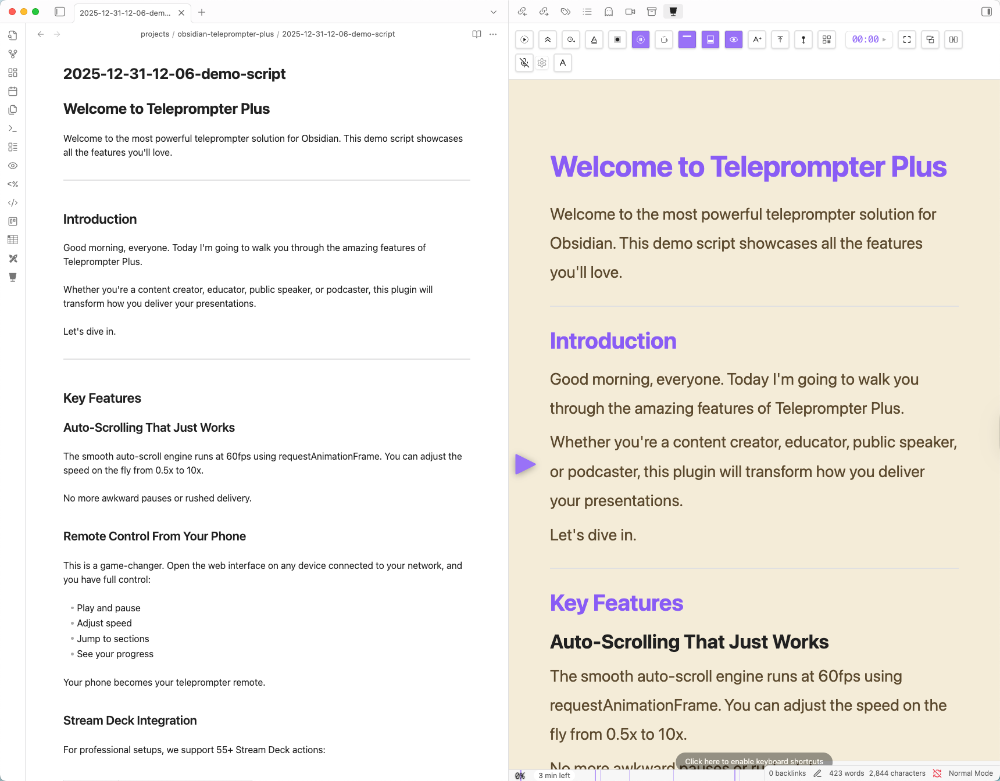
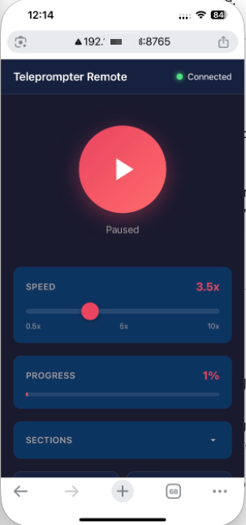
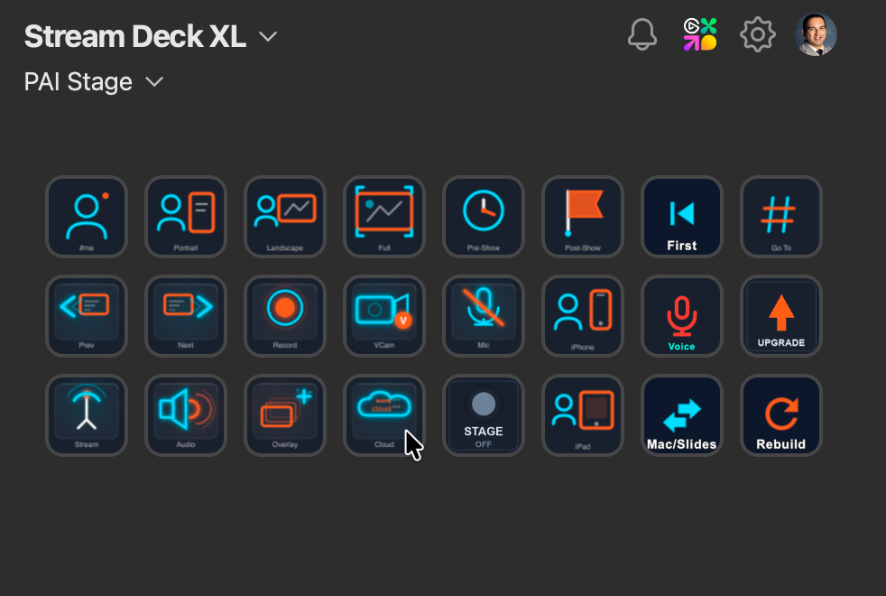
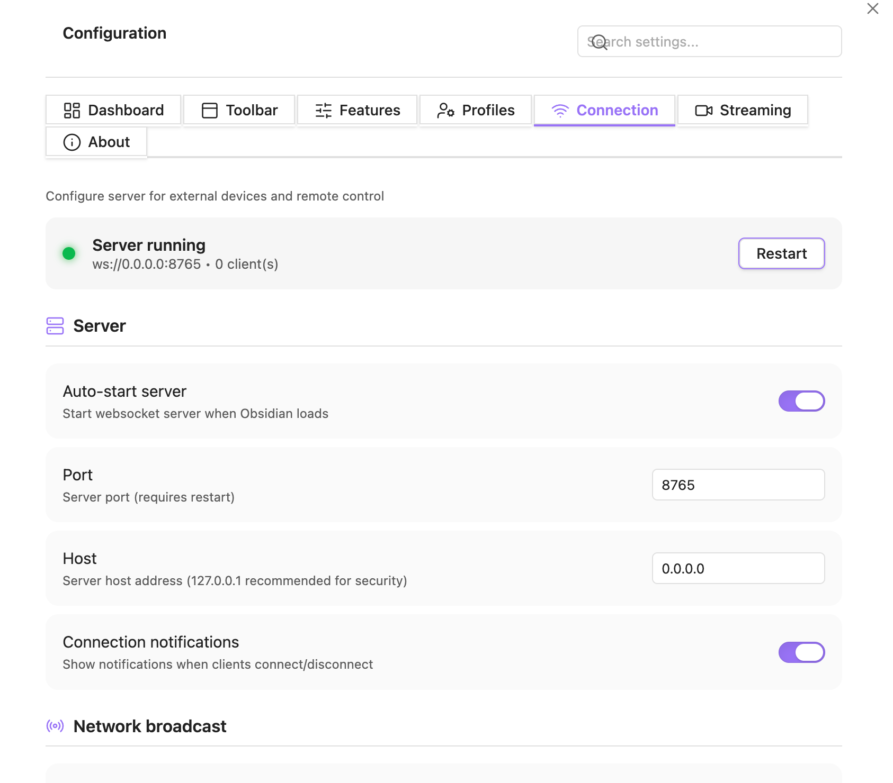
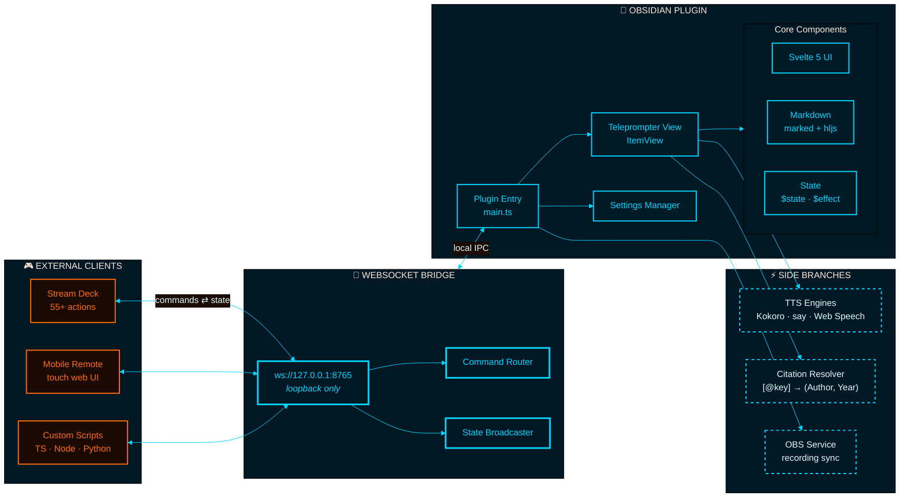

<p align="center">
  
</p>

# Teleprompter Plus

<p align="center"><strong>Professional teleprompter for Obsidian — Stream Deck hardware control, mobile remote, neural text-to-speech, and full Markdown support.</strong></p>

<p align="center">
  <a href="https://github.com/JuracyAmerico/obsidian-teleprompter-plus/releases/latest">
    
  </a>
  
  
  <a href="https://ko-fi.com/americocanada">
    
  </a>
</p>

<p align="center">Built for video recording, presentations, podcasts, speeches, and content creation.</p>

---

## What it does

Teleprompter Plus turns any Obsidian note into a professional teleprompter. Auto-scroll at adjustable speed, highlight your reading position, control playback from the keyboard, an Elgato Stream Deck, or a phone, and optionally read your script aloud with high-quality neural voices. Designed for creators who already live in Obsidian and want a teleprompter that speaks the same Markdown they write in.

## Key features

- **Smooth auto-scroll** — variable speed (0.5×–10×), countdown timer, manual scroll, horizontal/vertical flip for camera-rig mirrors
- **Hierarchical navigation** — collapsible header tree, abstract-scrollbar minimap, click-to-jump, active-section highlighting
- **Stream Deck integration** — 55+ actions across 8 categories with real-time bidirectional state sync ([catalog](docs/stream-deck-actions.md))
- **Mobile remote control** — touch-friendly web interface, control from any device on your network
- **Neural text-to-speech** — Kokoro MLX (22 voices, Apple Silicon), macOS `say`, Web Speech fallback, sentence-by-sentence highlighting
- **Citation resolution** — `[@ries2011]` spoken as *"(Ries, 2011)"* using your `.bib` files
- **Full Markdown support** — Obsidian syntax, math, callouts, code with syntax highlighting, tables, images, internal links
- **8 built-in themes** — Professional, Broadcast, Stream, Practice, Accessibility, Cinema, plus custom colors and fonts
- **OBS integration** — start/stop recording synced with teleprompter playback
- **Local WebSocket API** — build custom integrations in any language ([API reference](docs/websocket-api.md))

---

## Screenshots

### Main interface

<p align="center">
  
</p>

*Clean reading display with hierarchical navigation panel, eyeline guide, and real-time position tracking.*

### Mobile remote

<p align="center">
  
</p>

*Touch-friendly remote — phone, tablet, or second computer on the same network.*

### Stream Deck

<p align="center">
  
</p>

*55+ hardware actions with live state synchronization across all controls.*

### Settings

<p align="center">
  
</p>

*Six-tab settings: Dashboard, Toolbar, Features, Profiles, Connection, About.*

---

## Installation

### Community Plugin browser (recommended once published)

Obsidian → Settings → Community plugins → Browse → search **Teleprompter Plus** → Install → Enable.

### Manual install

1. Download `main.js`, `styles.css`, and `manifest.json` from the [latest release](https://github.com/JuracyAmerico/obsidian-teleprompter-plus/releases/latest).
2. Place them in `<your-vault>/.obsidian/plugins/teleprompter-plus/` (create the folder if needed).
3. Obsidian → Settings → Community plugins → Reload → enable **Teleprompter Plus**.

### Build from source

```bash
git clone https://github.com/JuracyAmerico/obsidian-teleprompter-plus.git
cd obsidian-teleprompter-plus
bun install
bun run build
# copy dist/main.js, dist/styles.css, and manifest.json into your vault's plugins folder
```

See [CONTRIBUTING.md](CONTRIBUTING.md) for the full development setup.

---

## Quick start

1. **Open** — click the teleprompter ribbon icon, or run *Open Teleprompter Plus* from the command palette (`Cmd/Ctrl + P`).
2. **Pick a note** — the active note loads automatically and updates live as you edit.
3. **Play** — click Play (or press your hotkey). Adjust speed with `+` / `−`, font size with `Aa+` / `Aa−`.
4. **Navigate** — click any header in the side panel to jump there. Click the minimap on the right to scrub.
5. **Reset** — Reset returns to the top.

For 25+ keyboard commands, see Obsidian → Settings → Hotkeys → Teleprompter Plus.

---

## Settings overview

| Tab | What's there |
|-----|--------------|
| **Dashboard** | Live preview, quick profile picker, health status |
| **Toolbar** | Choose which controls appear in the teleprompter toolbar |
| **Features** | Collapsible cards by category — appearance, playback, navigation, voice, OBS, WebSocket |
| **Profiles** | 8 built-in profiles + your own saved configurations |
| **Connection** | Optional local WebSocket server for Stream Deck + mobile remote |
| **About** | Plugin info, shortcuts, credits |

---

## Stream Deck

55+ actions across 8 categories — Playback, Speed, Font, Navigation, Display, Utility, Countdown, Flip. Real-time bidirectional state sync: the Stream Deck button updates live when you change the teleprompter from any source.

```json
{ "command": "toggle-play" }
{ "command": "set-speed", "value": 3 }
{ "command": "jump-to-header", "value": 1 }
```

Full action catalog, configuration steps, and Stream Deck plugin setup: **[docs/stream-deck-actions.md](docs/stream-deck-actions.md)**.

---

## WebSocket API

A local-only WebSocket server (default `ws://127.0.0.1:8765`) lets you build custom controls in any language.

```typescript
const ws = new WebSocket('ws://127.0.0.1:8765')

ws.onopen = () => ws.send(JSON.stringify({ command: 'play' }))

ws.onmessage = (e) => {
  const msg = JSON.parse(e.data as string)
  if (msg.type === 'state') console.log('speed:', msg.data.speed)
}
```

Full command list, state shape, and integration examples: **[docs/websocket-api.md](docs/websocket-api.md)**.

> **Privacy** — the server binds to `127.0.0.1` only. No LAN or internet exposure by default. The mobile remote piggy-backs on your existing Obsidian session over the same loopback bridge.

---

## Text-to-Speech

Three engines, selected automatically based on availability:

1. **Kokoro MLX** *(best quality, Apple Silicon)* — 22 voice presets (male/female, American/British English), audio-synced scrolling, sentence-by-sentence highlighting. See [docs/tts-setup.md](docs/tts-setup.md) for the one-time Python venv install.
2. **macOS `say`** — built-in system voices (Samantha, Daniel, etc.). No setup.
3. **Web Speech API** — universal fallback. Quality varies by OS and browser engine.

Pause/resume from the toolbar or keyboard. Citations are resolved from your bibliography (Quarto/Pandoc `.bib` files).

---

## Troubleshooting

Most common issues:

| Issue | Fix |
|-------|-----|
| **WebSocket port already in use** | Settings → Connection → change port (default `8765`). Click *Restart server*. |
| **Stream Deck not connecting** | Settings → Connection → *Restart server*. Confirm the Stream Deck plugin is installed and points at the same port. |
| **Plugin doesn't appear after install** | Verify `<vault>/.obsidian/plugins/teleprompter-plus/` contains `main.js`, `styles.css`, `manifest.json`. Reload Obsidian (`Cmd/Ctrl + R`). |
| **Content not updating when switching notes** | Close and reopen the teleprompter view. |
| **Fullscreen looks wrong** | Plugin fullscreen is in-window. For true OS fullscreen, use Obsidian's *View → Toggle Fullscreen* first. |
| **Pin window does nothing** | macOS and Windows only. Some Linux window managers override this. |

Full troubleshooting guide: **[docs/troubleshooting.md](docs/troubleshooting.md)**.

---

## Architecture


```mermaid
%%{init: {'theme':'base', 'themeVariables': {
  'background':'#0a0a0a',
  'primaryColor':'#001a26',
  'primaryTextColor':'#e0fbff',
  'primaryBorderColor':'#00d4ff',
  'secondaryColor':'#1a0a02',
  'tertiaryColor':'#001824',
  'lineColor':'#00d4ff',
  'fontFamily':'Inter, sans-serif'
}}}%%
flowchart LR
    subgraph Clients["🎮 EXTERNAL CLIENTS"]
        direction TB
        StreamDeck["Stream Deck<br/>55+ actions"]
        Mobile["Mobile Remote<br/>touch web UI"]
        Custom["Custom Scripts<br/>TS · Node · Python"]
    end

    subgraph Bridge["🔌 WEBSOCKET BRIDGE"]
        direction TB
        WS["ws://127.0.0.1:8765<br/><i>loopback only</i>"]
        Commands["Command Router"]
        Broadcast["State Broadcaster"]
        WS --> Commands
        WS --> Broadcast
    end

    subgraph Obsidian["📔 OBSIDIAN PLUGIN"]
        direction TB
        Plugin["Plugin Entry<br/>main.ts"]
        View["Teleprompter View<br/>ItemView"]
        Settings["Settings Manager"]
        Plugin --> View
        Plugin --> Settings

        subgraph Core["Core Components"]
            direction LR
            Svelte["Svelte 5 UI"]
            Markdown["Markdown<br/>marked + hljs"]
            State["State<br/>$state · $effect"]
        end
        View --> Core
    end

    subgraph Branches["⚡ SIDE BRANCHES"]
        direction TB
        TTS["TTS Engines<br/>Kokoro · say · Web Speech"]
        Cite["Citation Resolver<br/>[@key] → (Author, Year)"]
        OBS["OBS Service<br/>recording sync"]
    end

    StreamDeck <-->|"commands ⇄ state"| WS
    Mobile <--> WS
    Custom <--> WS
    Bridge <-->|"local IPC"| Plugin
    View --> TTS
    View --> Cite
    Plugin --> OBS

    classDef client fill:#1a0a02,stroke:#FF6B00,stroke-width:2px,color:#FF6B00
    classDef bridge fill:#001824,stroke:#00d4ff,stroke-width:3px,color:#00d4ff
    classDef obs fill:#001a26,stroke:#00d4ff,stroke-width:2px,color:#00d4ff
    classDef branch fill:#001824,stroke:#00d4ff,stroke-width:2px,stroke-dasharray: 5 5,color:#e0fbff

    class StreamDeck,Mobile,Custom client
    class WS,Commands,Broadcast bridge
    class Plugin,View,Settings,Svelte,Markdown,State obs
    class TTS,Cite,OBS branch
```

> Orange = command sent from a client. Cyan = state update broadcast back. All traffic stays on `127.0.0.1` — never on LAN.

A richer Excalidraw version of this diagram is in **[docs/architecture.excalidraw](docs/architecture.excalidraw)** — open it in Obsidian (with the Excalidraw plugin) to view, edit, or export to PNG/SVG for slides and presentations.

Design system, component reference, and icon catalog: **[docs/](docs/)**.

---

## Contributing

Pull requests welcome. See **[CONTRIBUTING.md](CONTRIBUTING.md)** for the tech stack, project structure, build workflow, code style, and contribution guidelines.

---

## Changelog & roadmap

Full version history in **[CHANGELOG.md](CHANGELOG.md)**. Latest release: see the [Releases page](https://github.com/JuracyAmerico/obsidian-teleprompter-plus/releases).

Have an idea? [Open a discussion](https://github.com/JuracyAmerico/obsidian-teleprompter-plus/discussions) or [submit an issue](https://github.com/JuracyAmerico/obsidian-teleprompter-plus/issues).

---

## Credits & license

Created by **Juracy Américo** ([@JuracyAmerico](https://github.com/JuracyAmerico)).

Built with [Obsidian](https://obsidian.md), [Svelte 5](https://svelte.dev), [TypeScript](https://www.typescriptlang.org), [Vite](https://vitejs.dev), [Tailwind CSS](https://tailwindcss.com), [marked.js](https://marked.js.org), [highlight.js](https://highlightjs.org), and [ws](https://github.com/websockets/ws).

MIT License. Copyright © 2024–2026 Juracy Américo. See [LICENSE](LICENSE).

### Support

If this plugin saves you time, you can support continued development:

<p align="center">
  <a href="https://ko-fi.com/americocanada">
    
  </a>
</p>
